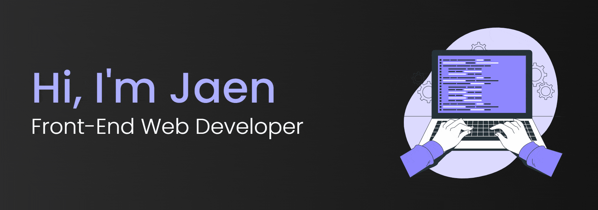
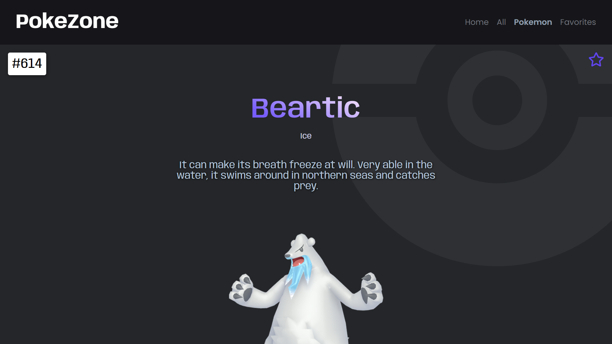

 

<!-- /////////////////////////////////// -->

  
<!--  -->

  

<!-- ///////////////////////////////////////////////////////////////////////////////////////////////// -->

## 🚀 Skill Set

| **Frontend** |
| :------------ |
| 
   &nbsp;  &nbsp; &nbsp;&nbsp;&nbsp;&nbsp;&nbsp;&nbsp;&nbsp;&nbsp;&nbsp;&nbsp;&nbsp; &nbsp;&nbsp;
 |
| **Backend** |
| 
&nbsp;&nbsp;&nbsp;&nbsp;&nbsp;&nbsp;&nbsp;&nbsp;&nbsp;&nbsp;&nbsp;&nbsp;&nbsp;&nbsp;&nbsp;&nbsp;
 |

<!-- ///////////////////////////////////////////////////////////////////////////////////////////////// -->

## 💡 Latest Projects

<a href="https://github.com/jaenfigueroa/PokeZone" ><strong>PokeZone</strong></a>
 This project is a Pokemon-themed website built with React.js and the PokeAPI.
Users can:
Search for a Pokémon by name and get suggestions based on matches.
Browse a list of more than 800 Pokémon cards, divided into pages, save as favorites or remove them, move them from position to the user's taste, change the language of the application between 3 languages, Spanish, English and Portuguese, saving the changes for at next session... 

 

<a href="https://github.com/jaenfigueroa/eCommerce" ><strong>eCommerce</strong></a>
 Users should be able to:
View the menu items or plates on the left side of the screen and add them to your cart on the right side. 
When there are no menu items in your cart, you should see a message that says, "Your cart is empty." 
When a plate is added to your cart, the Subtotal and Totals will automatically update... 

 
  
  

<a href="https://github.com/jaenfigueroa/Pomodoro-timer" ><strong>Pomodoro Timer</strong></a> 
Users should be able to:
Start the timer by clicking on the start link/button.
Once the user clicks start, the word start will change to stop.  Then, the user can click on the stop button to make the timer stop. 
Click on the gear icon to change the length (minutes and seconds) of the timer. 
Once the timer finishes, the ring should change from red to green and...

 

<a href="https://github.com/jaenfigueroa/JaenCraft" ><strong>JaenCraft</strong></a>
 Minecraft Game made with pure css and javascript.
 Users should be able to:
To walk, use the keys: W, A, S, D.
To crouch, hold the Shift key.
To jump, use the Space Bar.
For dap gesture, hold G.
To change character, use the K key.
To change the landscape, use the L key...

<!--   

## :octocat: Github Stats

 -->

