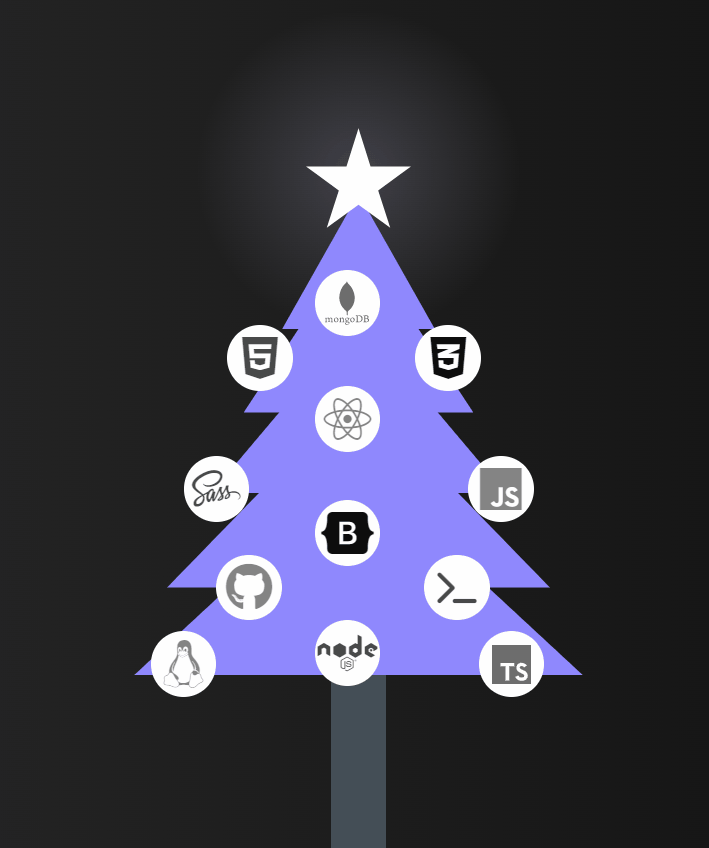
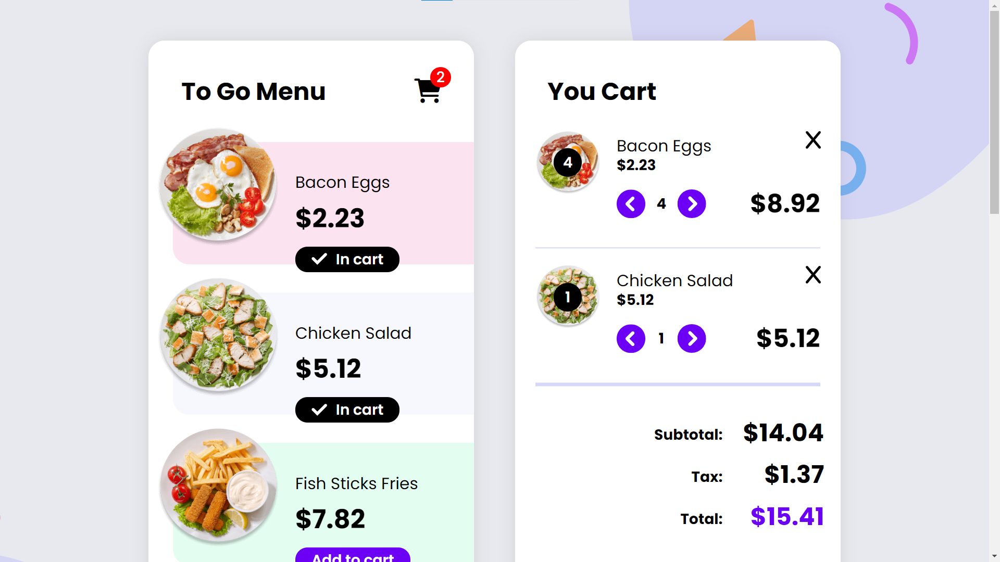
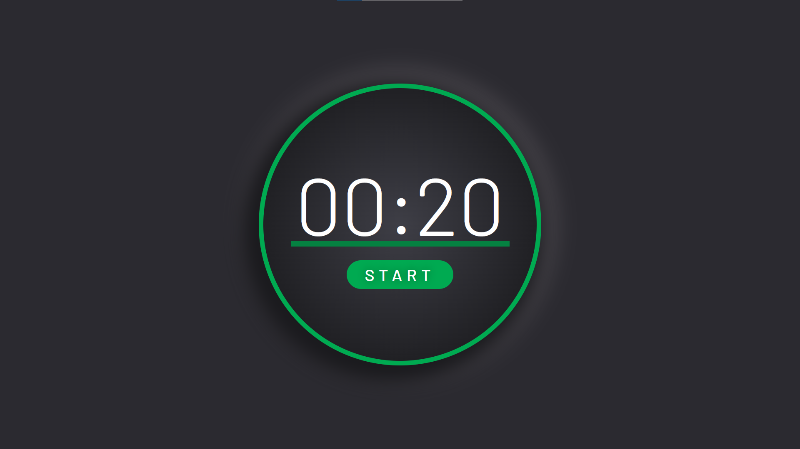
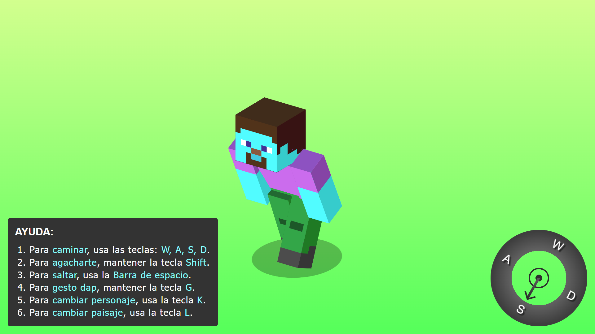

 

<!--  -->

## 🚀 My Skill Set

<!-- 

 -->

<table><tr><td valign="top" >

### Frontend

 
    
 
  &nbsp;
  &nbsp; &nbsp;
 &nbsp;
 &nbsp;
&nbsp;
&nbsp;
 

</td><td valign="top" >

### Backend

 &nbsp;
 &nbsp;
 &nbsp;
 &nbsp;
 &nbsp;
 &nbsp;

 
</td></tr></table>

## 💡 My latest projects

<a href="https://github.com/jaenfigueroa/eCommerce" ><strong>eCommerce</strong></a>
 Users should be able to:
View the menu items or plates on the left side of the screen and add them to your cart on the right side. 
When there are no menu items in your cart, you should see a message that says, "Your cart is empty." 
When a plate is added to your cart, the Subtotal and Totals will automatically update... 

 
  
  

<a href="https://github.com/jaenfigueroa/Pomodoro-timer" ><strong>Pomodoro Timer</strong></a> 
Users should be able to:
Start the timer by clicking on the start link/button.
Once the user clicks start, the word start will change to stop.  Then, the user can click on the stop button to make the timer stop. 
Click on the gear icon to change the length (minutes and seconds) of the timer. 
Once the timer finishes, the ring should change from red to green and...

 

<a href="https://github.com/jaenfigueroa/JaenCraft" ><strong>JaenCraft</strong></a>
 Minecraft Game made with pure css and javascript.
 Users should be able to:
To walk, use the keys: W, A, S, D.
To crouch, hold the Shift key.
To jump, use the Space Bar.
For dap gesture, hold G.
To change character, use the K key.
To change the landscape, use the L key...

 

<!-- ## :octocat: Github Stats

    

    
 

 -->

<!--  -->

<!-- ///////////////////////////////////////////////////////////////////////////////////////////////// -->

<h2>:octocat: My GitHub Stats</h2>

General Stats

    

    

