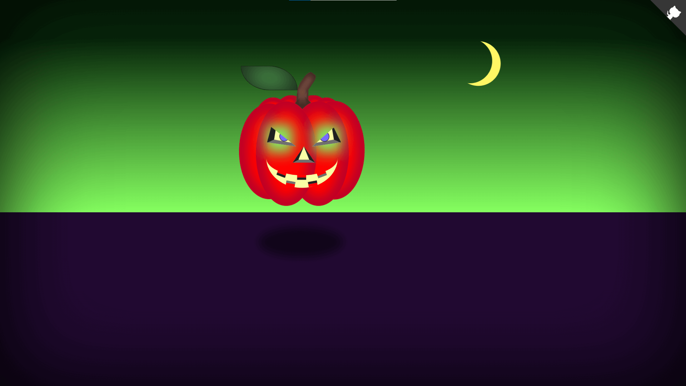

## 🎉 Latest Projects
    

    
    
    
    
    
    
    
    
    

## 🛠️ Skills

  
       &nbsp;&nbsp;&nbsp;&nbsp;&nbsp;&nbsp;&nbsp;&nbsp;&nbsp;&nbsp;&nbsp;&nbsp;&nbsp;&nbsp;&nbsp;

<!-- &nbsp;&nbsp;&nbsp; -->
<!--&nbsp; &nbsp;-->

