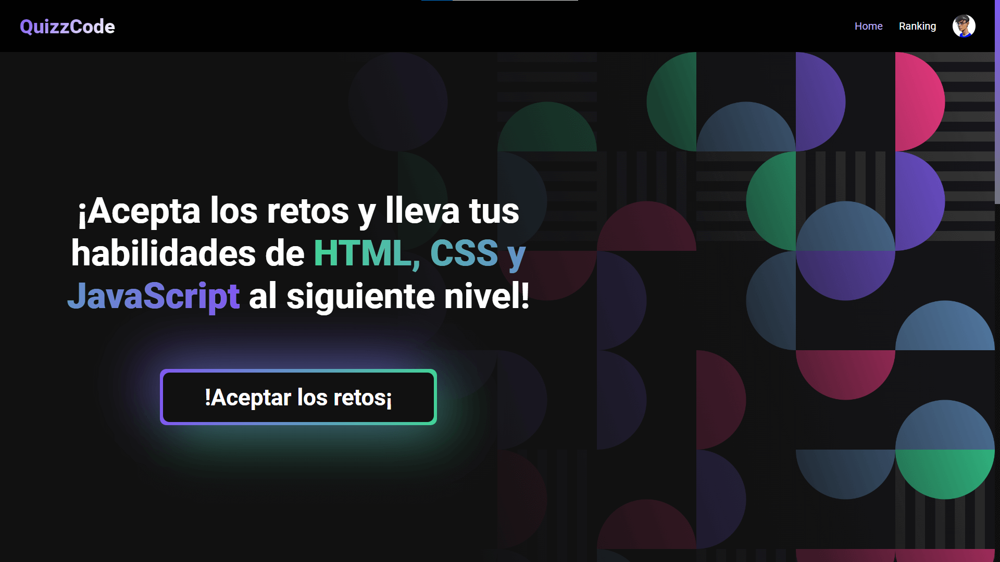
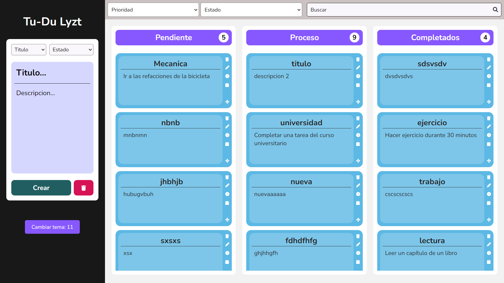

## 🎉 Latest Projects
    

    
    
    
    
    
    
    
    
    

## 🛠️ Skills

 <!-- REACT -->
 <!-- TS --> &nbsp;
 <!-- JS --> &nbsp;
 <!-- SASS -->
 <!-- NODEJS -->
 <!-- EXPRESS -->
 <!-- MONGO DB -->
 <!-- JEST -->

